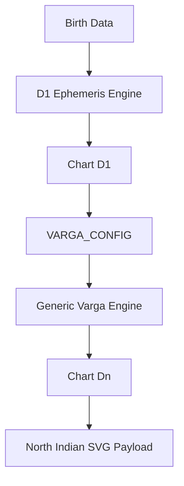

# Varga Engine Architecture

The chart pipeline now separates ephemeris calculation from divisional chart mapping.

1. `calculate_chart(...)` builds the D1/Rasi chart from birth data.
2. `calculate_varga_chart(...)` transforms D1 longitudes into the requested varga.
3. The existing house, aspect, dignity, and SVG payload builders run against the transformed chart.



## Main APIs

Use `generate_chart(...)` for chart-level calculations:

```python
from app.astrology.engine import generate_chart

d9 = generate_chart(birth_data, varga=9)
d60 = generate_chart(birth_data, varga=60)
```

Use `calculate_varga(...)` for direct longitude mapping:

```python
from app.astrology.varga.engine import calculate_varga

result = calculate_varga(longitude=123.45, division=9)
```

The result is a Pydantic model with `division`, `chart_code`, `chart_name`, `longitude`, `rashi`, `sign_number`, `degree`, and `segment`.

## HTTP API

Preferred generic endpoints:

```http
POST /chart?varga=1
POST /chart?varga=9
POST /chart?varga=60
POST /chart/svg?varga=60
GET /divisional/charts
```

Compatibility endpoints remain available:

```http
POST /d1
POST /d9
POST /d10
POST /d1/svg
POST /d9/svg
POST /d10/svg
```

## Supported Charts

The registry lives in `backend/app/astrology/varga/rules.py`.

Current supported classical charts:

`D1`, `D2`, `D3`, `D4`, `D5`, `D6`, `D7`, `D8`, `D9`, `D10`, `D11`, `D12`, `D16`, `D20`, `D24`, `D27`, `D30`, `D40`, `D45`, `D60`.

## Adding Custom Charts

Add a `VargaConfig` entry to `VARGA_CONFIG` with a chart code, division, name, and rule strategy. The API and frontend registry will expose it automatically once the backend is restarted.

For new rule families, add a strategy to:

- `backend/app/astrology/varga/base.py`
- `backend/app/astrology/varga/mappings.py`

Then add focused tests in `backend/app/tests/astrology/test_divisional.py`.

## Migration Notes

Old code:

```python
calculate_d9_chart(chart)
calculate_d10_chart(chart)
calculate_named_chart(birth_data, "D9")
```

New preferred code:

```python
generate_chart(birth_data, varga=9)
generate_chart(birth_data, varga=10)
```

The old functions are compatibility wrappers and continue to work.
